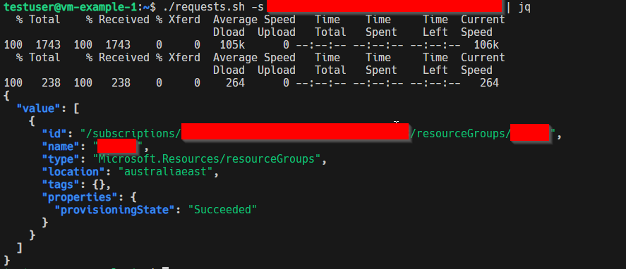

# Purpose

The purpose of this example is to demonstrate how a managed identity works under the hood. In essence it has a private api it can hit, then it can use the Bearer access token it acquires to perform api requests with it. Note that you must assign the managed idenity the correct role to be able to do anything. All that's handled for you is the `authentication`. The `authorization` still needs to be done indepently to it.

# Prerequisites

Ensure that you have:

1. An existing resource group.
1. An existing subnet id.
1. Terraform CLI installed.

# Running the example

To run this example:

1. Provide the resource group you want to put the virtual machine and it's components into.
1. Provide the subnet id you want to attach the virtual machine to.
1. Optionally-- depending on your subnet range, you may have to change the `azurerm_network_interface.example.ip_configuration.private_ip_address` value.
1. Create a `terraform.tfvars` file and populate that file with the appropriate input variables (for resource group and subnet id).
1. Run `terraform plan` to check the resources which are about to be made.
1. Run `terraform apply -auto-approve` to provision the virtual machine.
1. Assign the newly created managed identity `vm-example-1` the `Reader` role over your resource group.
1. SSH into the virtual machine. There is a script called `jump.sh` which is offered which prints out the password (we're not worried about the data on the ephemeral VM) for ease. You can use `jump.sh` to quickly jump into the VM.
1. copy the `request.sh` to your virtual machine and make it executable with `chmod u+x requests.sh`.
   - You can run the script `./requests.sh` and it will tell you the parameter you need to enter.
   - To see the output better I'd reccomend to pipe the result into `jq`.
1. You should see output similar to this:
   
1. Exit the connection from the session with `ctrl+d`.
1. Run `terraform apply -auto-approve -destroy` to clean up the resources we created.
